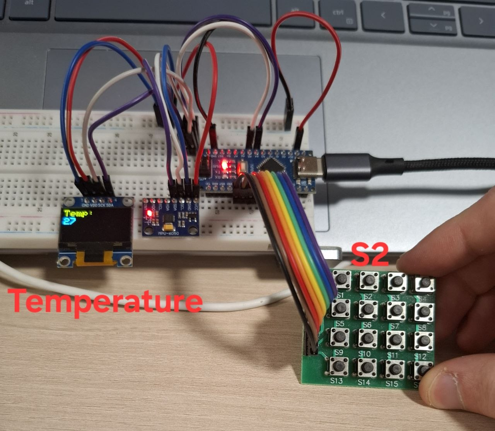
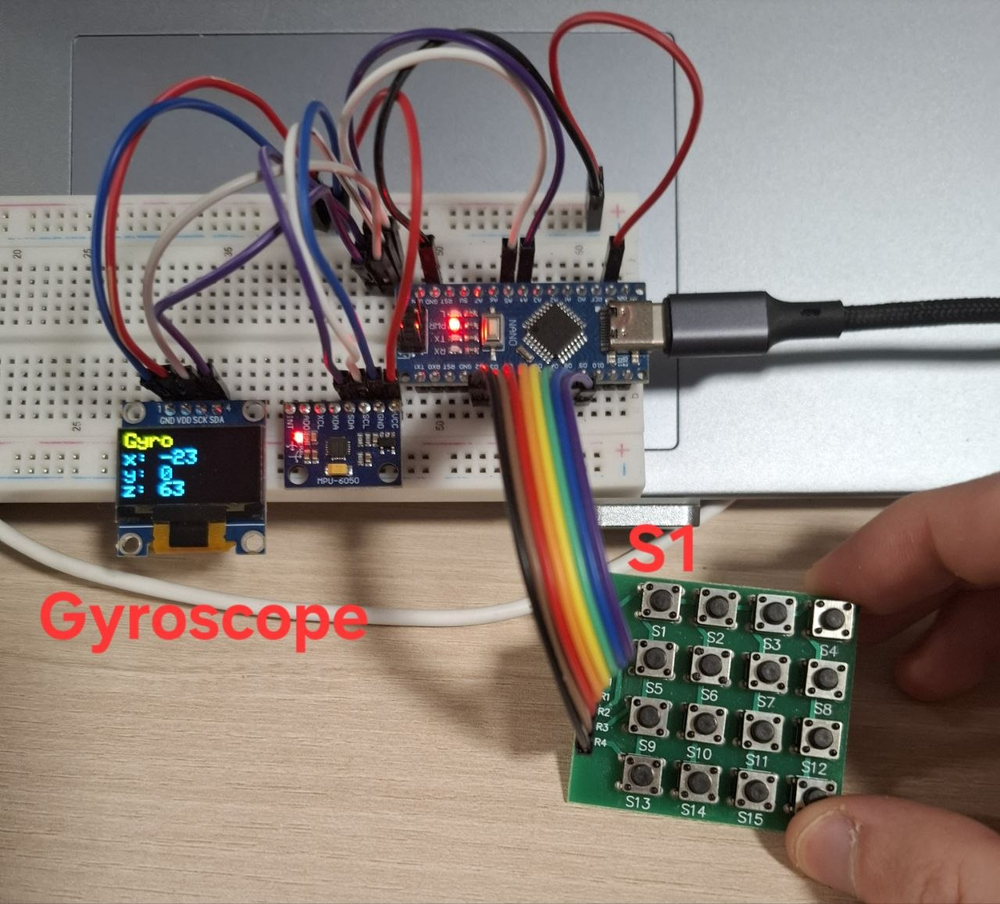

## Gyroscope & Keypad Arduino Project

A small embedded system based on Arduino Nano, MPU6050, OLED display, and a 4×4 matrix keypad.
The project reads real-time gyroscope data from the MPU6050 and displays the current values on the OLED screen. 
The matrix keypad is used to interact with the system and control its functionality.
 
